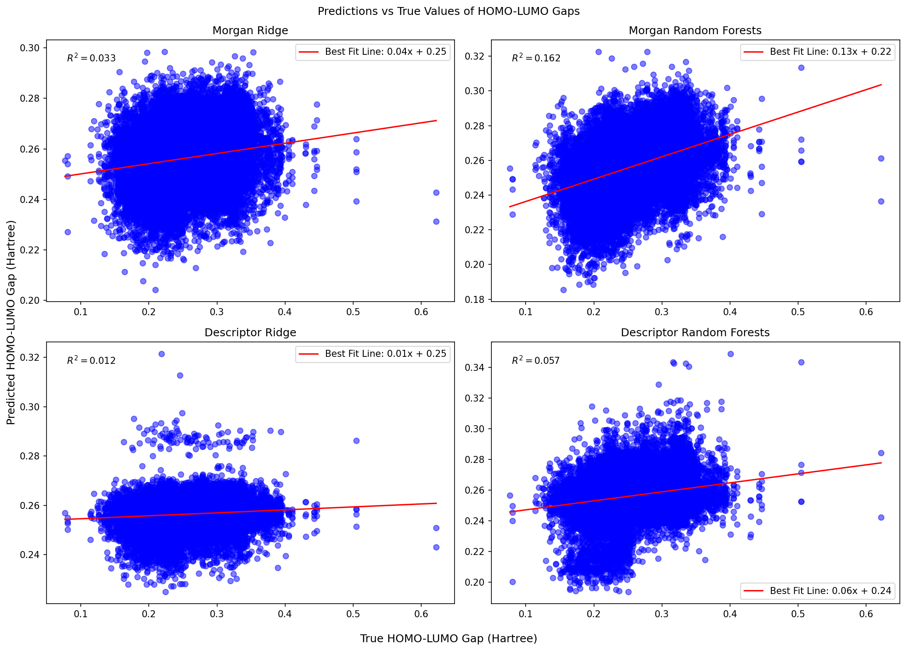

# Calculating HOMO-LUMO Gap Via Fingerprint and Descriptor methods

Supervised learning of ~ 130,000 molecules using Ridge and Random Forests Regression.

DeepChem QM9 dataset used for SMILES strings and Gap energy levels.

## Libraries
DeepChem, matplotlib, numpy, pandas, rdkit, seaborn, scikit-learn, scipy

## Purpose
- Create a model that can use physicochemical descriptors to calculate the energy difference between the HOMO and LUMO.
- Create a model that can use Morgan Fingerprints to calculate the HOMO-LUMO Gap

## Context
- The HOMO-LUMO Gap is a quantum property of all molecules. The gap is the energy difference between the (H)ighest (O)ccupied (M)olecular (O)rbital,
and the (L)owest (U)noccupied (M)olecular (O)rbital
- A Molecular Orbital is a space where electrons are likely to be found near a molecule. Figure 1 shows that these consist of the sigma (σ) and pi (π),
bonding and anti-bonding(*) orbitals.
- Understanding the energy difference between these orbitals is important. Due to there being a difference of energy, when an orbital goes from
the HOMO to the LUMO, energy must be gained, and then when the electron drops back to the HOMO, energy is released, often in the form of a photon (light).
- The HOMO-LUMO Gap can determine how easily a molecule can be excited. A low gap signifies an easily excitable molecule, while a big gap is less excitable.
  

   
  Figure 1. Molecular Orbital diagram of Oxygen

## Procedure
### data_preparation.py
- Import data from DeepChem and combine both training and test sets for later distribution.
- Find baseline
### descriptors.py
- Using DeepChem data, convert SMILES to Mols and create DataFrame of descriptors + Gap.
### fingerprints.py
- Using DeepChem data, convert SMILES to Morgan fingerprints. 1024 bits used for less memory usage.
### hyperparameter_search.py
- Split Morgan data into 2 train sets of 20% and ~10% of data.
- Use 20% of train data on to hyperparameter tune the Morgan Ridge model
- Use 10% of training data to hyperparameter tune the Morgan Random Forests model
- Save best parameters for later use
- Delete data and split descriptor data into 80% and ~15% of total data.
- Repeat previous steps using descriptor data
- Save best parameters to JSON for final model testing.
### regression_model.py
- 80/20 test split Morgan data and fit to Ridge and Random Forests pipeline using JSON and parameters
- Repeat using Descriptor data
- Graph preds vs true data points for all 4 models
- Graph train and test scores along with baseline

## Results

   
  Figure 2. Graph of all 4 model's training and test scores

- Morgan Ridge showed a very small improvement of ~.0011 over baseline. No known overfitting or underfitting.
- Morgan RF Showed the biggest improvement of ~.0043 Hartree. .008 difference between training and test data signifies overfitting, more parameter tuning required for more accurate data.
- Descriptor Ridge showed the smallest improvement of ~.0003 over baseline. No known overfitting or underfitting.
- Descriptor RF showed an improvement of ~.0016 Hartree. A .0015 difference is significant enough to be overfitting, more tuning required.

   
  Figure 3. Graph of model's true vs predicted values with R^2 values

Above graph shows that none of the models performed particularly well. The best R^2 value was .162 from the Morgan Fingerprint Random Forest. This is well below a good score of around
.8 R^2. This indicates that the molecules that were trained and tested have too many differences to accurately generalize.

## Applications of Findings
### The HOMO-LUMO gap is used in many fields.
- The gap relates to the reactivity and metabolic stability of a molecule, both critical properties in drug discovery. Reactive molecules may 
degrade before reaching their target.
- The gap length determines what wavelength of light is released, this is often used in OLEDs.
- Solar cells use the energy from the sun to create electricity. However, using molecules with smaller gaps can increase the rate at which 
sunlight is converted because sunlight has very low energy. This matches the low energy requirements to excite a small gap molecule.
### Finding the HOMO-LUMO Gap using ML models can save time and money
- DFT is often used to accurately find the HOMO-LUMO Gap. However DFT often takes hours to days per molecule, leading to costly and time consuming
processes. By making a ML model that can accurately predict the gap, computation cost and time can be saved. Millions of molecule gap predictions can be
shortened from years to hours. This can be useful for drug discovery, as time is often more important than perfect accuracy.

## Limitations and Future Work
- All models used 2D molecular representations (SMILES/RDKit). The HOMO-LUMO gap is intrinsically a 3D quantum mechanical property. 3D-aware Graph 
  Neural Networks like SchNet, and DimeNet achieve ~0.006 Hartree MAE on QM9, roughly 6x better than the best model here.
- Morgan RF overfitting could be reduced with further hyperparameter tuning on a machine with more RAM.
- 1024-bit fingerprints were used instead of 2048-bit due to memory constraints. Higher bit counts may improve Morgan model performance.
- Gradient boosting methods (XGBoost, LightGBM) were not explored and may outperform Random Forests on this dataset.
- SHAP values were not used in descriptors dataset. Feature selection may limit noise during training.

---

## Part 2 - Aromatic Subset Analysis With XGBoost and SHAP

### Overview
The second part of this project intends to append some limitations in the previous part
- A Gradient boosting model (XGBoost) was explored in conjunction with Random Forests
- A smaller dataset was used to decrease noise and have a higher accuracy. QM9 dataset was limited to only Aromatic molecules (21,981 of 132,430).
- SHAP values were used to remove any noise in descriptors dataset.

### Procedure
#### data_preparation_p2.py
- Similar structure to part 1 data preparation
- Added Aromatic mask to only have molecules with at least 1 aromatic ring
- Added histogram to show approximate distribution of gaps
#### descriptors_p2.py
- Almost identical to part 1 file except a few more descriptors were added
#### fingerprints_p2.py
- Identical to part 1 file except 2048 bits were used instead: Due to fewer molecules more space was available
#### hyperparameter_search_p2.py
- 80/20 Morgan data split for easier tuning
- Morgan XGBoost and Random Forests pipelines made and tuned using Random Search
- descriptor data loaded in 80/20 split
- Descriptor XGBoost and Random Forest pipeline made and tuned using Random Search
- Best parameters saved to json file
#### feature_selection.py
- Descriptor data loaded
- XGBoost pipeline fitted using best_params_p2.json
- SHAP values calculated and plotted for bar plot and beeswarm
- features table printed and SHAP values below .0005 were removed
- reduced features model retrained using new data and tested against all features model
- All above repeated for Random Forests Descriptors models
#### regression_model_p2.py
- Data loaded and 80/20 train test split used
- Morgan XGBoost and RF model trained on data, train and test scores appended to lists
- Descriptors XGBoost and RF models trained, scores appended to lists
- Predictions vs true values of all 4 models graphed
- Train vs test MAE vs baseline of all 2 models graphed
- All graphs saved

### Results

